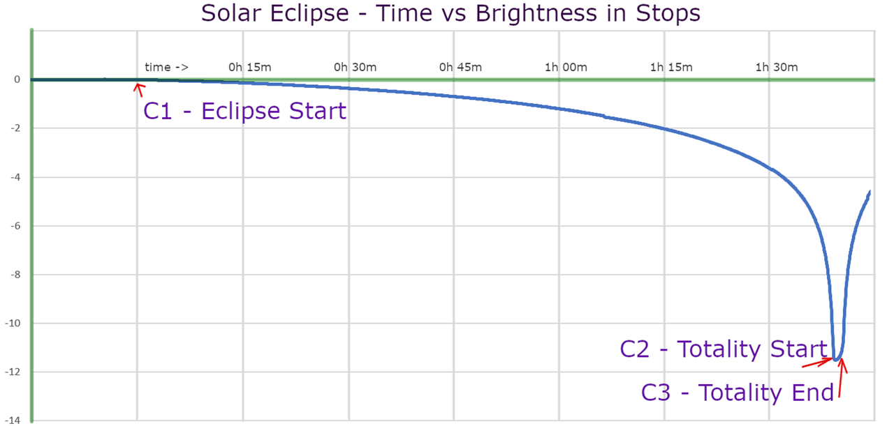
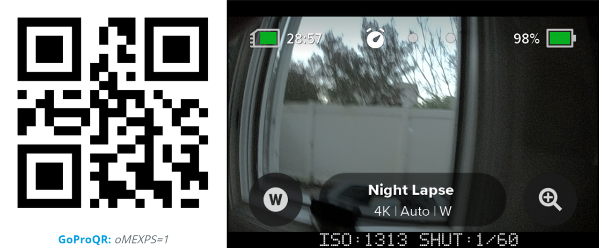
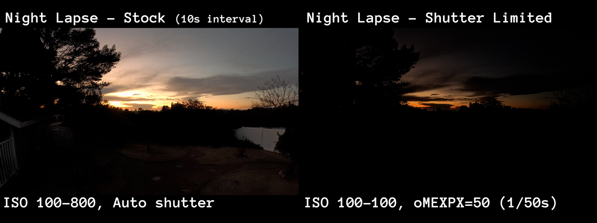

# Eclipse Timelapse Planner

<script src="../../jquery.min.js"></script>
<script src="../../qrcodeborder.js"></script>
<script src="../../html2canvas.min.js"></script>
<style>
        #qrcode{
            width: 100%;
        }
        div{
            width: 100%;
            display: inline-block;
        }
</style>


Shooting a solar eclipse is tricky, but a very worthwhile experience, so let's preconfigure your GoPro so you can enjoy the rare event live and after with a cool timelapse capture. 

## TL;DR

There is an automatic time lapse calculator and generator at the bottom of this page, designed to get the most from your Solar Eclipse.

## The Geeky Details

The first tricky issue when shooting a solar eclipse is the sheer change in dynamic range from full sun to when it's fully covered by the moon, 
the light level can vary up to 12 stops. 12 stops, the light halving in brightness 12 times, would be the difference in shooting with 1/1000 shutter to a 4 second exposure. 
This example data was from a solar eclipse measured in Australia in 2023 (thanks to Matt Parker's data from [**Stand-up Maths**](https://youtu.be/IuUMxNfDfFY?si=iytXca2frHqOakOB&t=945) - the whole video is a worth watch.)



The light levels change very slowly initially, but incredibly rapidly as the totality approaches. The first 90 minutes, the light drops only 3-4 stops, you will notice the light 
feels odd after 90 minutes, but your camera will have compensated so much to make it mostly unnoticeable. We can improve on the default camera behavior using Labs firmware.

## GoPro Night Lapse
A stock GoPro has a great night-lapse feature designed for day to night to day transitions, keeping a good exposure throughout, yet this exposure logic is not ideal for a solar 
eclipse before and after the totality (it is fine during totality.) None of the time-lapse modes on GoPro have an exposure lock option, but with a potential 12-stop change, locking the 
shutter 1/1000 and ISO at 100 (or exposing correctly at C1) will result in a mostly black image at C2. So we still need some of the autoexposure goodness, but with some constraints 
so that the light drop is more visibly dramatic.  

## GoPro Labs Firmware

### Extension - EXPS
Things to try with GoPro Labs. ```oMEXPS=1``` this will display ISO and shutter for your current shooting mode. Test with time-lapse or night-lapse, recording to see the exposure 
for different light levels. Practice well before the eclipse. This feature requires the latest Labs firmware on HERO12 and HERO11 to view exposure during a timelapse 
(it works only in video modes on older releases.)  



Note: The exposure settings for preview can be different than when recording, so experiment while capturing a timelapse.  


### Extension - EXPX
Once you see the shutter behavior with Labs extension above, we can now consider setting an upper limit to the shutter with ```oMEXPX=<your maximum shutter time>```.  
Below are extracted frames from two simultaneous Night Lapse captures of the sunset, one with the shutter limited to 1/50th of a second.



Limiting the ISO to 100 is also our recommendation for shooting the eclipse, as we estimate that from full daylight to totality, the shutter will range from around 1/1600th to 2.5 seconds at 100 ISO. 
Fitting nicely within Night Lapse with a 4-second interval, with an Auto shutter.  

It is tricky to capture both the massive drop in light, and the drama of totality, in a single timelapse capture. If possible, this is best achieved with multiple cameras, 
editing and blending the results in post.

#### Type 1 - Capture mostly optimized for the totality
Night Lapse ISO 100, 4s interval, Shutter Auto. If you started 15 minutes before totality and stopped 15 minutes after, the result is a ~17 second timelapse, with 2 seconds in totality (if a 4-minute totality.)  

#### Type 2 - Capture optimized for the drop in brightness
Timelapse ISO 100, 10s interval, but limiting the shutter to 1/30th of a second (a creative choice, my best guess.) At 1/30, the last 5-6 stops of the eclipse will be more dramatically show the 
light impact upon the landscape. Capturing one hour before and after totality, the result is a ~25 second timelapse, ~1 second in totality.

Note: Timelapse stock (not Night Lapse) is limited to a maximum of 1/8 second exposures, combined with ISO maximum of 100, this is a good option without Labs firmware. 
This is what I used in 2017. However, the now only the last 3-4 stops will show a dramatic light change, and this is in the last minute before and after totality, 
and with a 10s interval, you will only get about six frames of the light drop in the timelapse (quarter second at playback speed.)  Using the 1/30th limit, the estimated 
length of the light drop-off will double in the final timelapse.  

#### Type 3 - Super optimized for the totality
Night Lapse ISO Max 800, Auto interval, Shutter Auto, Labs shutter limited to 1s. Auto shutter with Auto interval is a special mode in Night Lapse, in this mode it will take frames as fast as possible, 
giving you more frames in the totality. When it is bright, this is ~3fps, when it is dark Labs firmware can limit the exposure time to 1fps. If you have 4 minutes of totality, and only 2 minutes before and after,  
this 8-minute timelapse will result in ~32s playback time, with 4 seconds in the totality in playback. Optional, you could limit the exposure to half a second for up to 8 seconds in totality.

#### Type 4 - Combining 2 & 3
For those who want to experiment further, Labs firmware allows you to script the camera, so that certain modes or actions can be performed at particular moments. 
The problem is we haven’t had a prior eclipse to practice on. The very experimental script would be to run type 2) capture until the totality, then switch to type 3), automatically 
creating two separate video timelapses. 

## Eclipse Time-lapse QR Code

Set up an automatic action via QR Code, so you can ready your camera well in advance, and it will automatically turn on and record with your desired time and settings.<br>
<br>
Find 2024 eclipse times [**for your location**](https://nso.edu/for-public/eclipse-map-2024/)

Setup A thru D options:

<div id="eTYPE"><b>A - Select Capture Type:</b><br>
  &nbsp;&nbsp;&nbsp;&nbsp;&nbsp;&nbsp;<input type="radio" id="type1" name="type" value="1" checked><label for="type1"><b>Type 1</b> - Easy - 4s Night Lapse</label>             starting <input type="range" style="width: 100px;" id="t1len" name="t1len" min="10" max="120" value="15"><label for="t1len"></label> <b id="type1len"></b> minutes before<br>
  &nbsp;&nbsp;&nbsp;&nbsp;&nbsp;&nbsp;<input type="radio" id="type2" name="type" value="2"><label for="type2"><b>Type 2</b> - Cool - 10s Time Lapse, exposure limited</label>   starting <input type="range" style="width: 100px;" id="t2len" name="t2len" min="10" max="120" value="60"><label for="t2len"></label> <b id="type2len"></b> minutes before<br>
  &nbsp;&nbsp;&nbsp;&nbsp;&nbsp;&nbsp;<input type="radio" id="type3" name="type" value="3"><label for="type3"><b>Type 3</b> - Very Cool - Super optimized 1-3fps Night Lapse</label> starting <input type="range" style="width: 100px;" id="t3len" name="t3len" min="2"  max="10"  value="2" ><label for="t3len"></label> <b id="type3len"></b> minutes before<br>
  &nbsp;&nbsp;&nbsp;&nbsp;&nbsp;&nbsp;<input type="radio" id="type4" name="type" value="4"><label for="type4"><b>Type 4</b> - Experimental - Switching between type 2 and 3 at totality (two automatic captures)</label><br>
</div>
<div id="eRES"><b>B - Capture Resolution:</b><br>&nbsp;&nbsp;&nbsp;&nbsp;
  &nbsp;&nbsp;<input type="radio" id="res1" name="res" value="" checked><label for="res1">current</label>
  &nbsp;&nbsp;<input type="radio" id="res2" name="res" value="r4"><label for="res2"> 4K 16:9</label>
  &nbsp;&nbsp;<input type="radio" id="res3" name="res" value="r4T"><label for="res3">4K 4:3 (H11)</label>
  &nbsp;&nbsp;<input type="radio" id="res4" name="res" value="r4X"><label for="res4">4K 8:7 (H12)</label>
  &nbsp;&nbsp;<input type="radio" id="res5" name="res" value="r5"><label for="res5"> 5K 16:9</label>
  &nbsp;&nbsp;<input type="radio" id="res6" name="res" value="r5T"><label for="res6">5K 4:3 (H11)</label>
  &nbsp;&nbsp;<input type="radio" id="res7" name="res" value="r5X"><label for="res7">5K 8:7 (H12)</label>
</div>
<div><b>C - Totality Start:</b> <input type="range" style="width: 540px;" id="tlstrt" name="tlstrt" min="720" max="1080" value="780"><label for="tlstrt"></label> <b id="starttext"></b></div>
<div><b>D - Totality Length:</b> <input type="range" style="width: 300px;" id="tlend" name="tlend" min="1" max="5" value="4"><label for="tlend"></label> <b id="lentext"></b> minutes &nbsp;&nbsp; Totality End Time: <b id="endtext"> seconds</b></div>

Estimated Timelapse Playback Length: <b id="tllen"></b> seconds

Forum to [**discuss the best settings**](https://github.com/gopro/labs/discussions/823), and to share your resulting videos.
 
<div id="opDT">
<input type="checkbox" id="dt" value="oT" checked> <label for="dt">Set date + time automatically</label> <br>
<small>Note: do save a QR Code image with this enabled. This is designed to for live QR Codes, not printed or saved to camera rolls.</small>
</div>

<div id="qrcode_txt" style="width: 360px">
  <center>
  <div id="qrcode"></div><br>
  <b><font color="#009FDF">GoProQR:</font></b> <em id="qrtext"></em><br>
  <b><font color="#005CAC">Eclipse Timelapse</font></b>
  </center>
</div>
<br>
Share this QR Code as a URL: <small id="urltext"></small><br>
<button id="copyBtn">Copy URL to Clipboard</button>
      
**Compatibility:** Labs enabled HERO11 and HERO12 (likely some support with older Labs enoubled cameras, please test.) 

updated: March 20, 2024

[More features](..) for Labs enabled cameras

<script>
var once = true;
var qrcode;
var cmd = "mPdP!60SQ!1R";
var clipcopy = "";
var lasttimecmd = "";
var changed = false;

function makeQR() 
{	
  if(once === true)
  {
    qrcode = new QRCode(document.getElementById("qrcode"), 
    {
      text : "!oMBURN=\"\"",
      width : 360,
      height : 360,
      correctLevel : QRCode.CorrectLevel.M
    });
    once = false;
  }
}

function checkTime(i) {
    if (i < 10) {i = "0" + i;}  // add zero in front of numbers < 10
    return i;
}

function pad(num, size) {
    var s = num+"";
    while (s.length < size) s = "0" + s;
    return s;
}

function padTime(i) {
  if (i < 10) {i = "0" + i;}  // add zero in front of numbers < 10
  return i;
}
function padTime1000(i) {
  if (i >= 10 && i < 100) {i = "0" + i;}  // add zero in front of numbers < 100
  else if (i < 10) {i = "00" + i;}  // add zero in front of numbers < 10
  return i;
}

function dcmd(cmd, id) {
    var x;
	if(document.getElementById(id) !== null)
	{
		x = document.getElementById(id).checked;
		if( x === true)
			cmd = cmd + document.getElementById(id).value;
	}
	else
	{
		for (i = 1; i < 15; i++) { 
			var newid = id+i;
			if(document.getElementById(newid) !== null)
			{
				x = document.getElementById(newid).checked;
				if( x === true)
					cmd = cmd + document.getElementById(newid).value;
			}
		}
	}
	return cmd;
}


function dval(id) {
    var x;
	var val = "";
	{
		for (i = 1; i < 15; i++) { 
			var newid = id+i;
			if(document.getElementById(newid) !== null)
			{
				x = document.getElementById(newid).checked;
				if( x === true)
					val = document.getElementById(newid).value;
			}
		}
	}
	return val;
}


function timeLoop()
{
  if(document.getElementById("tlstrt") !== null)
  {
	var t1len = parseInt(document.getElementById("t1len").value);
	var t2len = parseInt(document.getElementById("t2len").value);
	var t3len = parseInt(document.getElementById("t3len").value);
	
	var start = parseInt(document.getElementById("tlstrt").value);
	var startmins = start;
	var caplen = parseInt(document.getElementById("tlend").value);
	var endmins = startmins + caplen;
	var playlen = 0;
	if(endmins >= 1440)
		endmins -= 1440;
		
	var starthourstime;
	var startminstime;	
	var endhourstime;
	var endminstime;
		
	starthourstime = Math.trunc(startmins / 60);
	startminstime = startmins - starthourstime * 60;	
	
	endhourstime = Math.trunc(endmins / 60);
	endminstime = endmins - endhourstime * 60;
		
	var stxt = pad(starthourstime, 2) + ":" + pad(startminstime, 2);
	var etxt = pad(endhourstime, 2) + ":" + pad(endminstime, 2);

	var type = dcmd("","type"); 
	var res = dcmd("","res"); 
	
	if(type == "1")
	{
		startmins -= t1len;
		starthourstime = Math.trunc(startmins / 60);
		startminstime = startmins - starthourstime * 60;	
		
		endmins += t1len;
		endhourstime = Math.trunc(endmins / 60);
		endminstime = endmins - endhourstime * 60;
		
		var stime = pad(starthourstime, 2) + ":" + pad(startminstime, 2);
		var etime = pad(endhourstime, 2) + ":" + pad(endminstime, 2);
	
		cmd = "\"Eclipse TL\nType1\"" + "!" + stime + "N" + "mNLp.4eA" + res + "tb1w55i1M1sM!S!" + etime + "E";
		
		playlen = (endmins - startmins)*60/4/30;
	} 
	else if(type == "2")
	{
		startmins -= t2len;
		starthourstime = Math.trunc(startmins / 60);
		startminstime = startmins - starthourstime * 60;	
		
		endmins += t2len;
		endhourstime = Math.trunc(endmins / 60);
		endminstime = endmins - endhourstime * 60;
		
		var stime = pad(starthourstime, 2) + ":" + pad(startminstime, 2);
		var etime = pad(endhourstime, 2) + ":" + pad(endminstime, 2);
	
		cmd = "\"Eclipse TL\nType2\"" + "!" + stime + "N" + "mTp.10" + res + "tb1w55i1M1sMoMEXPX=30!S!" + etime + "EoMEXPX=0";
		
		playlen = (endmins - startmins)*60/10/30;
	} 
	else if(type == "3")
	{
		startmins -= t3len;
		starthourstime = Math.trunc(startmins / 60);
		startminstime = startmins - starthourstime * 60;	
		
		endmins += t3len;
		endhourstime = Math.trunc(endmins / 60);
		endminstime = endmins - endhourstime * 60;
		
		var stime = pad(starthourstime, 2) + ":" + pad(startminstime, 2);
		var etime = pad(endhourstime, 2) + ":" + pad(endminstime, 2);
	
		cmd = "\"Eclipse TL\nType3\"" + "!" + stime + "N" + "mNLpeA" + res + "tb1w55i8M1sMoMEXPX=1!S!" + etime + "EoMEXPX=0";
		
		playlen = ((endmins - startmins - caplen)*60*3 + caplen)/30;
	}
	else	
	{
		starthourstime = Math.trunc(startmins / 60);
		startminstime = startmins - starthourstime * 60;	
		
		var etime1 = pad(starthourstime, 2) + ":" + pad(startminstime, 2);
		
		startmins -= t2len;
		starthourstime = Math.trunc(startmins / 60);
		startminstime = startmins - starthourstime * 60;	
		
		endmins += t3len;
		endhourstime = Math.trunc(endmins / 60);
		endminstime = endmins - endhourstime * 60;
		
		var stime = pad(starthourstime, 2) + ":" + pad(startminstime, 2);
		var etime2 = pad(endhourstime, 2) + ":" + pad(endminstime, 2);
	
		cmd = "\"Eclipse TL\nType4\"" + "!" + stime + "N" + "mNLp.10" + res + "tb1w55i1M1sMoMEXPX=30!S!" + etime1 + "EpeAi8M1sMoMEXPX=1!S!" + etime2 + "EoMEXPX=0";
		
		playlen = ((t2len)*60/10 + (t3len)*60*3 + caplen)/30;
	}
	
	
	var dt = document.getElementById("dt").checked;
	if(dt === true)
	{
	  var today;
	  var yy,mm,dd,h,m,s;
	  
	  today = new Date();
	  yy = today.getFullYear() - 2000;
	  mm = today.getMonth() + 1;
	  dd = today.getDate();
	  h = today.getHours();
	  m = today.getMinutes();
	  s = today.getSeconds();
	  ms = today.getMilliseconds();
	  yy = padTime(yy);
	  mm = padTime(mm);
	  dd = padTime(dd);
	  h = padTime(h);
	  m = padTime(m);
	  s = padTime(s);
  
	  cmd = "oT" + yy + mm + dd + h + m + s + cmd;
	}
	
	
	playlen = Math.trunc(playlen*10)/10;
	
	document.getElementById("starttext").innerHTML = stxt;
	document.getElementById("endtext").innerHTML = etxt;
	document.getElementById("lentext").innerHTML = caplen;
	document.getElementById("tllen").innerHTML = playlen;

	document.getElementById("type1len").innerHTML = t1len;
	document.getElementById("type2len").innerHTML = t2len;
	document.getElementById("type3len").innerHTML = t3len;
	
  }
  
  qrcode.clear(); 
  qrcode.makeCode(cmd);
  
  
  if(cmd != lasttimecmd)
  {
	changed = true;
	lasttimecmd = cmd;
  }
	
  if(changed === true)
  {
	document.getElementById("qrtext").innerHTML = cmd;
	clipcopy = "https://gopro.github.io/labs/control/set/?cmd=" + cmd + "&title=Eclipse%20Timelapse";
	document.getElementById("urltext").innerHTML = clipcopy;
	changed = false;
  }
  
  var t = setTimeout(timeLoop, 100);
}

function myReloadFunction() {
  location.reload();
}


async function copyImageToClipboard() {
    html2canvas(document.querySelector("#qrcode_txt")).then(canvas => canvas.toBlob(blob => navigator.clipboard.write([new ClipboardItem({'image/png': blob})])));
}
async function copyTextToClipboard(text) {
	try {
		await navigator.clipboard.writeText(text);
	} catch(err) {
		alert('Error in copying text: ', err);
	}
}

function setupButtons() {	
    document.getElementById("copyBtn").onclick = function() { 
        copyTextToClipboard(clipcopy);
	};
}

makeQR();
setupButtons();
timeLoop();

</script>
