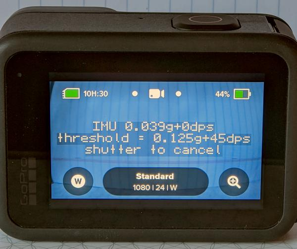

# IMU (Camera Motion) Detection to Start and Stop Captures

While the motion detection feature looks for changes in the image, this is only looking for motion of the camera itself. The Inertial measurement unit (IMU), has a gyroscope and accelerometer for measuring rotation and linear acceleration, this can now be used to start and stop captures.  Example: Drone use, only capture while in flight, automatically stop recording when motion stops.

## Customize IMU Detected Capture

&nbsp;&nbsp;&nbsp;&nbsp;&nbsp;&nbsp;<b>Sensor selection:</b>&nbsp;&nbsp;
  <input type="radio" id="imu1" name="imu" value="G" > <label for="GYRO">GYRO </label>&nbsp;&nbsp;
  <input type="radio" id="imu2" name="imu" value="A" > <label for="ACCL">ACCL </label>&nbsp;&nbsp;
  <input type="radio" id="imu3" name="imu" value="I" checked> <label for="BOTH">BOTH (default)</label>

&nbsp;&nbsp;&nbsp;&nbsp;&nbsp;&nbsp;**Start Sensitivity** <input type="range" id="snstvty" name="snstvty" min="1" max="9" value="6"><label for="snstvty"></label>&nbsp;&nbsp;<b id="snstvtytext"></b> (1-low to 9-high) 
&nbsp;&nbsp;&nbsp;&nbsp;&nbsp;&nbsp;**End Sensitivity** <input type="range" id="esnstvty" name="esnstvty" min="0" max="9" value="0"><label for="snstvty"></label>&nbsp;&nbsp;<b id="esnstvtytext"></b> (0 - off, 1-low to 9-high) 
&nbsp;&nbsp;&nbsp;&nbsp;&nbsp;&nbsp;**Start Delay** <input type="range" id="delay" name="delay" min="0" max="60" value="4"><label for="delay"></label>&nbsp;&nbsp;<b id="delaytext"></b> seconds before reading sensors. 
&nbsp;&nbsp;&nbsp;&nbsp;&nbsp;&nbsp;**Hold Time** <input type="range" id="hold" name="hold" min="0" max="60" value="5"><label for="hold"></label>&nbsp;&nbsp;<b id="holdtext"></b> seconds, to continue recording after motion has stopped.  

&nbsp;&nbsp;&nbsp;&nbsp;&nbsp;&nbsp;<input type="checkbox" id="repeat" name="repeat" checked> 
<label for="repeat">Repeat IMU triggered capture.</label> 

Note: you will have to manually set the mode in which you capture.  The detector can be combined with the Hindsight feature on HERO9. 
 

 

QR Command: <b id="qrtext">time</b> 

## Sensitivity

| Sensitivity | GYRO degrees per second  | ACCL units gravity | Activity               |
|-------------|--------------------------|--------------------|------------------------|
| 1           | 360dps                   | 1.0g               | Throwing the camera    |
| 2           | 180dps                   | 0.5g               | Jumps                  |
| 3           | 90dps                    | 0.25g              | most handheld movement |
| 4           | 45dps                    | 0.125g             | ..                     |
| 5           | 24dps                    | 0.064g             | any hand movement      |
| 6           | 15dps                    | 0.032g             | ..                     |
| 7           | 8dps                     | 0.016g             | ..                     |
| 8           | 4dps                     | 0.008g             | tiny movement          |
| 9           | 2dps                     | 0.004g             | small tremor           |

## On Screen Feedback

## ver 1.00
[BACK](..)

