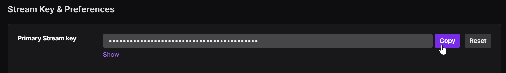

# RTMP Live-Stream Setup (requires Labs on HERO9)

Prerequisites for Live-streaming
1. You need to have stored the WiFi credentials on the camera. 
2. Know the RMTP URL address that you intend to stream to.

When both of these a stored within the camera's non-volatile memory, you can Live-stream with a single QR Code at any time (while you are still in WiFi range.)
		
		
## Pre-store Your RTMP Address for Live 

Enter the full RTMP address here: <input type="text" id="rtmptxt" value=""> (e.g. rtmp://live.twitch.tv/app/live_5554355...) 

For Twitch users:
1. Select your base URL From this [list of servers](https://stream.twitch.tv/ingests/).
2. Login to you Twitch account, and get your [stream key](https://link.twitch.tv/myChannelSettings) from your channel settings.
	

 

<b>Scan the code above once for the camera to always know the target RTMP address.</b>

		
To live stream via QR Code, you will have to manually pair the GoPro with the network (once), via the GoPro App. Follow these steps.

## Launch Your Live Stream 

Select your Resolution:
  <input type="radio" id="rs1" name="rs" value="S"><label for="480p">480p </label>&nbsp;
  <input type="radio" id="rs2" name="rs" value="M" checked><label for="720p">720p </label>&nbsp;
  <input type="radio" id="rs3" name="rs" value="L"><label for="1080p">1080p </label>

Store a high quality copy on camera:
 <input type="checkbox" id="cp" value="t" checked><label for="cp">1080p60 Copy</label> 

 

QR Command: <b id="qrtext">time</b> 

<b>Scan the code above to go live in 15-20 seconds</b>

        
## ver 1.00
[BACK](..)

